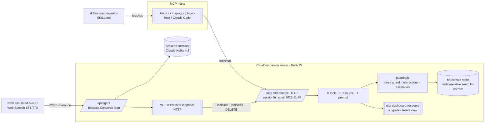

# CareCompanion

An eldercare-coordination agent for Alexa+: medication reminders with **safety guardrails**, daily voice check-ins
with **symptom escalation**, and a **family caregiver dashboard delivered as an MCP App** — all behind one
self-hosted MCP server, packaged with an Agent Skill.

Built for the [Build, Ship, Shape: Amazon Developer Hackathon](https://amazonappdev2026.devpost.com/)
(Alexa+ track · AWS Builder mini · Open Source mini). MIT licensed; created from scratch during the hackathon window.

> **Status:** MCP server, guardrails, Bedrock brain, Agent Skill and both UIs are built and tested. Live deployment,
> demo video and final polish are in progress (see [Status](#status)).

## What ships

| Piece                                    | Where                                       | What it is                                                                                                                                     |
| ---------------------------------------- | ------------------------------------------- | ---------------------------------------------------------------------------------------------------------------------------------------------- |
| **MCP server** (Streamable HTTP + stdio) | `src/`                                      | 8 tools · 1 resource · 1 prompt on `POST\|GET\|DELETE /mcp` (spec 2025-11-25, sessionful), plus a `carecompanion-mcp` stdio binary.            |
| **Guardrails**                           | `src/domain/guardrails/`                    | Duplicate/too-soon dose guard with explicit confirmation; informational interaction + allergy warnings; fail-safe symptom escalation.          |
| **Dashboard MCP App**                    | `ui/` → `ui://carecompanion/dashboard.html` | The family dashboard rendered inline by MCP App hosts (Alexa+, MCP Inspector, basic-host) from the `caregiver_summary` tool.                   |
| **Agent Skill**                          | `skills/carecompanion/SKILL.md`             | Teaches any agent the five safe workflows against the server (validated with `skills-ref`).                                                    |
| **Simulated Alexa+ experience**          | `web/` + `src/agent/`                       | An Echo-Show-style web app with browser voice; its brain is Amazon Bedrock (Claude Haiku 4.5) calling the MCP tools through a real MCP client. |

## Quickstart

Requires Node 22.19+ (24 recommended). No AWS account is needed for the MCP server or the web app: without Bedrock a
rule-based brain answers the demo conversations.

```bash
git clone https://github.com/skiitk2510/carecompanion.git
cd carecompanion
npm install
npm run build          # server + dashboard view + web app
npm start              # http://127.0.0.1:3000  (MCP at /mcp, web app at /, health at /healthz)
```

Then, in another terminal:

```bash
npm run mcp:lifecycle  # curl walk-through of the Streamable HTTP session lifecycle
npm run mcp:inspect    # MCP Inspector UI against the running server
npm run agent:smoke    # the five demo beats through POST /api/agent (prints which brain + tools answered)
npm test               # 160+ tests: guardrails, seed, MCP tools over the SDK client, agent loop, REST routes
```

Local MCP hosts can use stdio instead: `node dist/server/bin/stdio.js`. Opening the repository in Claude Code gives
you both the server (`.mcp.json`) and the Agent Skill (`.claude/skills/carecompanion`) — ask for "Margaret's morning
briefing" and watch the tools run; [docs/skill-walkthrough.md](docs/skill-walkthrough.md) has the full script.

Copy `.env.example` to `.env` to change the household timezone, seed behaviour, Bedrock settings or the demo
token; every variable is documented there.

## The MCP surface

Every tool returns text written to be spoken aloud (`content[0].text`) **and** typed `structuredContent` — hosts
that compose their own reply (Alexa+ does) get clean data; hosts that read text get a sentence that already works.
Invalid arguments never reach a handler; every handler is pure in-memory work (a few milliseconds — no LLM runs
inside the server, as a voice host expects).

| Tool                | Who       | Purpose                                                                                                                                                                     |
| ------------------- | --------- | --------------------------------------------------------------------------------------------------------------------------------------------------------------------------- |
| `get_todays_plan`   | elder     | Today's doses, what is next, anything missed, appointments, whether the elder has checked in.                                                                               |
| `log_dose`          | elder     | Record a dose by whatever the elder calls it. The guard **refuses** duplicates/too-soon doses with `requiresConfirmation`; overrides need a reason and alert the caregiver. |
| `skip_dose`         | elder     | Record a deliberate skip of the next due dose; critical medications alert the caregiver.                                                                                    |
| `daily_checkin`     | elder     | Mood + symptoms in the elder's words; escalation bands (watch / urgent / emergency) notify caregivers and return `emergencyGuidance` to speak first.                        |
| `call_for_help`     | elder     | Alert every caregiver at once; return emergency guidance.                                                                                                                   |
| `add_medication`    | caregiver | Always adds; returns interaction/allergy `warnings` with a disclaimer (informational, never medical advice).                                                                |
| `caregiver_summary` | caregiver | Adherence (7/30 d), today's doses, open alerts, check-in trend, appointments — **the MCP App tool** (`_meta.ui.resourceUri`).                                               |
| `resolve_alert`     | caregiver | Acknowledge / resolve with a note; idempotent audit trail.                                                                                                                  |

Resource `carecompanion://elder/{elderId}/adherence` (JSON, listed per elder) · Prompt `morning_briefing`.
Argument details: [skills/carecompanion/references/tools.md](skills/carecompanion/references/tools.md).

## Architecture



- **Transport:** the sessionful `NodeStreamableHTTPServerTransport` pattern (session map, GET stream, DELETE) —
  the SDK's stateless default answers GET/DELETE with 405, which voice hosts treat as a broken lifecycle.
- **Domain:** instants are UTC, "today" and schedule slots are computed in the household timezone with
  DST-safe Intl math (`src/domain/time.ts`); dose slots are virtual, outcomes are recorded; missed doses and
  missing check-ins are swept lazily on read, so the server needs no timers.
- **Guardrails** are pure functions with their own tests: `doseGuard.ts` (max daily / min interval / inactive →
  refuse with confirmation), `interactions.ts` (curated pair table + brand aliases + allergy classes),
  `escalation.ts` (phrase bands with word boundaries; help → everyone).
- **MCP App:** `caregiver_summary` is registered with `registerAppTool` and the view with `registerAppResource`;
  the view talks to the server only through the host bridge (`callServerTool`) and ships with an empty CSP. It
  follows the Alexa+ design guide: in **inline** mode it renders a wider-than-tall summary block (stat tiles, next
  doses, open alerts) with a control that requests **fullscreen** for the full dashboard; tokens sit on one root
  scale (16 px body, 8/12 px radii, 48 px touch targets) and the host's theme variables win over the fallbacks.

## Runtime MCP calls (how the agent uses the server)

The Alexa+ track requires the track technology to be called at runtime. The simulated Alexa+ brain does not shortcut
into the domain layer: every turn opens a real MCP session over loopback HTTP, lists the tools, calls them, and
terminates the session — the same wire protocol an external host uses, visible in the server log as
`session opened` → `mcp tools/call` → `session closed`.

- `src/agent/mcpExecutor.ts` — `openMcpExecutor()`: `Client` + `StreamableHTTPClientTransport`, `listTools()` →
  Bedrock tool specs (schemas sanitized), `callTool()` per tool use, `terminateSession()`.
- `src/agent/bedrockBrain.ts` — the Converse tool-use loop (all results of a round returned in one user turn, round
  cap, result truncation, emergency guidance harvested from structured results).
- `src/agent/ruleBrain.ts` — the offline intent router that drives the same tools when Bedrock is unavailable.
- `src/agent/service.ts` — brain selection, 5-minute Bedrock pause after access/credential failures, daily turn cap.

## Demo

- Live server + web experience: _coming with the deployment_ (`/mcp`, `/`, `/healthz`).
- Demo video: _coming_.
- Script and recording checklist: [docs/demo-script.md](docs/demo-script.md). The demo menu in the web app can
  re-seed the household and set the local time (`POST /api/demo/reset`, token-gated) so the "mid-morning" and
  "evening" beats are reproducible at any hour.

**What is real:** the MCP server, tools, guardrails, MCP App view, Agent Skill, Bedrock loop, tests.
**What is simulated:** the Alexa+ device (a web app with browser speech), caregiver notifications (recorded on
the alert and logged — no SMS/email is sent), and the household itself (synthetic data, resets on restart).

The first request after ~15 minutes idle on the free hosting tier takes up to a minute (cold start); the app is
otherwise stateless per session, so MCP clients simply re-initialize after a restart (`404 / -32001`).

## Onboarding to Alexa+ (optional)

The server meets the [Alexa+ MCP Toolkit](https://developer.amazon.com/docs/alexaplus/add-ons/mcp-toolkit-quickstart.html)
requirements as documented: Streamable HTTP, MCP 2025-11-25, a remote URL, tools well inside the 500 ms round-trip
budget, and visuals via MCP Apps. With a US developer account the deployed URL can be registered as a dev-stage
add-on and tried in Amazon's web simulator:

```bash
alexa-ai configure                                   # Login with Amazon (browser)
alexa-ai new mcp --name "CareCompanion" --locale en-US --mcp-server-url "https://<your-host>/mcp"
alexa-ai deploy                                      # development stage → Add-on ID → web simulator
```

Amazon's **Local Inspector** (`addon-local-inspector https://<your-host>/mcp`, distributed through the Developer
Console) renders the `caregiver_summary` MCP App in Small (≤10") and Large (≥11") device frames and writes a
certification verdict; the view was built for exactly those breakpoints.

### Service-level authentication (Alexa+ Tier 1)

The public demo is unauthenticated on purpose (synthetic household, no PHI). The toolkit's Tier-1 model — the
add-on fetches a short-lived Bearer token with the OAuth 2.0 client-credentials grant and sends it on every MCP
request — is built in and switched on with three variables:

```bash
MCP_AUTH=client_credentials MCP_CLIENT_ID=alexa-addon MCP_CLIENT_SECRET=<long random string> PUBLIC_URL=https://<host>
```

With that set: `GET /.well-known/oauth-authorization-server` and `/.well-known/oauth-protected-resource/mcp` describe
the server (RFC 8414 / 9728); `POST /oauth/token` (HTTP Basic client auth, `grant_type=client_credentials`,
optional `resource=<PUBLIC_URL>/mcp`) returns a token valid for up to an hour; `/mcp` answers `401` JSON without a
`WWW-Authenticate` header to anything else, exactly as the Alexa+ checklist asks. Tokens are stateless HMAC
envelopes, so restarts and multiple instances need no shared store. The simulated Alexa+ brain mints its own token
for its loopback calls. User-level account linking (Tier 2) is out of scope for a synthetic household.

## Safety & scope

CareCompanion is a coordination and reminder tool, **not medical advice**. Interaction warnings come from a small,
curated, informational table and always carry a disclaimer; escalation errs toward alerting a human; nothing is
overridden without an explicit confirmation and a reason from the person. Demo data is synthetic — no real
patients, no PHI. A production deployment would add authentication (the SDK's OAuth middleware is ready to mount),
a real datastore, and clinically maintained interaction data.

## AWS / Bedrock setup (optional)

The conversational brain uses Amazon Bedrock (Claude Haiku 4.5 via the `us.` cross-region inference profile).
Without it, `POST /api/agent` answers through the rule-based brain and reports `brain: "rules"`.

1. In the Bedrock console for **us-east-1**, open _Model access_ → Anthropic and submit the one-time **use case
   details form**, then enable **Claude Haiku 4.5**. Until then Bedrock answers
   `ResourceNotFoundException: Model use case details have not been submitted…` and the app falls back to rules.
2. Check access without spending anything:
   ```bash
   aws bedrock get-foundation-model-availability --model-id anthropic.claude-haiku-4-5-20251001-v1:0 --region us-east-1
   ```
   `agreementAvailability.status` must be `AVAILABLE`.
3. Provide credentials with `bedrock:InvokeModel` (a local profile, or `AWS_ACCESS_KEY_ID` / `AWS_SECRET_ACCESS_KEY`
   on the host) and keep `BEDROCK_REGION=us-east-1` — the region is pinned explicitly because a profile's default
   region may differ.
4. `npm run agent:smoke` shows which brain answered each turn; `/api/agent/status` shows usage and caps.

## Project layout

```
src/            server: config, logging, domain (model, time, store, seed, guardrails, actions), mcp (tools,
                resources, prompts, schemas), agent (Bedrock loop, rule brain, MCP executor), http (routes)
ui/             the dashboard MCP App view (React, single-file build → dist/ui/mcp-app.html); ui/src/components
                is the shared Dashboard used by both UIs
web/            the simulated Alexa+ web app (Vite + React + Tailwind; Web Speech API)
skills/         the Agent Skill (SKILL.md, references, install script)
test/           vitest suites (domain, MCP over the SDK client, agent, REST)
scripts/        curl lifecycle walk-through, agent smoke
docs/           friction log, product feedback, demo script, Devpost text
```

Development: `npm run dev` (server with reload) + `npm run dev:web` (Vite dev server proxying `/api` and `/mcp`);
`npm run typecheck`, `npm run lint`, `npm run format`, `npm run skill:validate`.

Boot prints `Warning: Server is binding to 0.0.0.0 without DNS rebinding protection`. That is expected: host-header
validation is applied to `/mcp` only, so platform health checks on `/healthz` keep working (friction log FL-03).

## Status

- [x] M0 walking skeleton: sessionful Streamable HTTP, stdio, lifecycle tests, CI
- [x] M1 domain, guardrails, seeded household (145 tests)
- [x] M2 MCP surface: 8 tools · 1 resource · 1 prompt, MCP App registration
- [x] M3 Bedrock Converse brain over a loopback MCP client, rule-brain fallback, `/api/agent`
- [x] M4 simulated Alexa+ web app with browser voice
- [x] M5 dashboard MCP App view verified in basic-host (initialized, tool result delivered, auto-resize)
- [ ] M6 Agent Skill walk-through, docs, product feedback
- [ ] M7 live deployment · M8 video · M9 submission

## Feedback for the tool makers

- [docs/friction-log.md](docs/friction-log.md) — dated friction entries in the hackathon's format
- [docs/product-feedback.md](docs/product-feedback.md) — what worked / needs work for every SDK, API and service used

## License

MIT — see [LICENSE](LICENSE).
